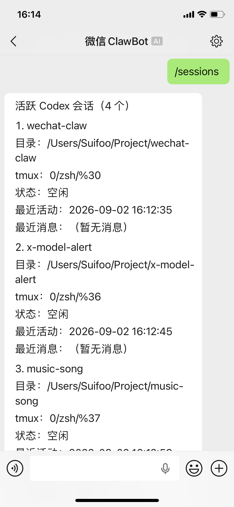
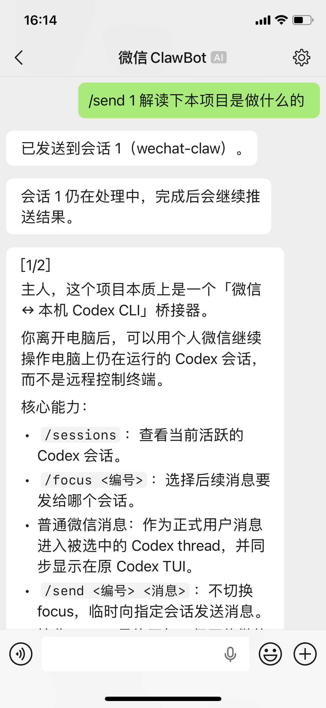

# WeChat Claw

> Keep building, even when your laptop is out of reach.

Continue active Codex CLI sessions on your Mac directly from WeChat.

[](https://www.python.org/)


[中文](README.md)

<p align="center">
  
  &nbsp;&nbsp;
  
</p>

## Usage

Requires macOS, Python 3.11+, and an authenticated Codex CLI.

```bash
curl -fsSL https://raw.githubusercontent.com/mctang24/wechat-claw/refs/heads/main/install.sh | bash
```

## Commands

| Command | Behavior |
| --- | --- |
| `/sessions` | List active sessions and their numbers |
| `/focus <number>` | Select where subsequent messages go |
| `/unfocus` | Clear the current focus |
| `/send <number> <message>` | Send once to a specific session |
| `/approve [code]` | Approve a pending request |
| `/help` | Show help and the current focus |

## License

[MIT](LICENSE)
